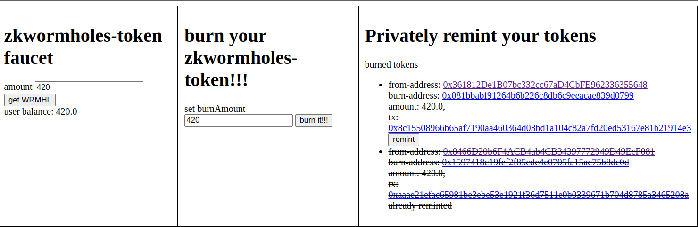

# example of a erc20 with EIP7503 
An erc20 token with [EIP7503](https://eips.ethereum.org/EIPS/eip-7503) (zkwormholes) style private transfers.  
Using storage proofs to track the balances of the burn addresses (bassically commitments). 

try it out: https://bafybeih4zlk6jlopnxgectlar7yd7hrp7jovtkk545ktdb2wgdsoa7kf4m.ipfs.dweb.link/


  

### deploymed on scroll sepolia
https://sepolia.scrollscan.com/address/0x20EF4cC5d68198acacDe4468107314A629522d6E
## install
```shell
yarn install
```

## deploy
### set environment variables
```shell
npx hardhat vars set PRIVATE_KEY; #<=deployment key
npx hardhat vars set SEPOLIA_SCROLL_ETHERSCAN_KEY;;
```

### deploy
```shell
cd zkwormholesExample;
npx hardhat run scripts/deploy.cjs --network scrollSepolia;
npx hardhat ignition deploy ignition/modules/Token.cjs --network scrollSepolia --verify #couldnt verify within deploy.cjs so this is a hacky work around
```


## test remint sepoilia
### set reminter privatekey (can be same as deployer)
```shell
npx hardhat vars set RECIPIENT_PRIVATE_KEY;
```

### do remint
```shell
cd zkwormholesExample;
npx hardhat run scripts/proofAndRemint.js 
```

<!-- ## generate Prover.toml and test_main() of main.nr
(just dumps it in the terminal for now)  
#### fullprover  
```shell
cd zkwormholesExample;
node scripts/getProofInputs.js --maxTreeDepth=248 --maxRlplen=850 \
--contract=0xDb9Fb1e8d6A0b9C0072D3E88f8330ec9Cc62E21f \
--recipient=0x93211e420c8F552a0e4836f84892a0D4eb5D6D54 \
--secret=123 \
--rpc=https://scroll-sepolia.drpc.org 
```
#### smolprover
```shell
cd zkwormholesExample;
node scripts/getProofInputs.js --maxTreeDepth=32 --maxRlplen=650 \
--contract=0xDb9Fb1e8d6A0b9C0072D3E88f8330ec9Cc62E21f \
--recipient=0x93211e420c8F552a0e4836f84892a0D4eb5D6D54 \
--secret=123 \
--rpc=https://scroll-sepolia.drpc.org \
``` -->

## notes

### smolprover and fullProver
The contract uses 2 verifiers: **smolprover** and **fullProver**. This is because noirjs has a **limit on ram (4gb)**, so **smollProver** uses **smaller** parameters that **assume** the chain **doesnt becomes larger.**  
**FullProver** is there just incase the **chain grows outside** of the parameters of **smolprover**.  
More specifically **full prover** is able to go down the **full** **248 tree depth** and can handle a **blockheader** up to **850 bytes**.  
While **smolprover** is set to **tree depth** of **26** and **650 bytes** for the **blockheader**

```python
global MAX_HASH_PATH_SIZE = 26;
global MAX_RLP_SIZE = 650;
```
*at line 13-14 in circuits/smolprover/src/main.nr*
*https://github.com/jimjimvalkema/scrollZkStorageProofs/blob/main/zkwormholesExample/circuits/smolProver/src/main.nr#L13*

### no BLOCKHASH
The **BLOCKHASH** opcode on scroll **isnt ready** yet so the contract relies on a **trusted oracle** (the deployer) to tell the contract what blockhash is valid.  

### different blockheaders
**sepolia** scroll **block header** is **different** then scroll **mainnet**. It includes **baseFeePerGas**, while **mainnet** scroll **doesnt** yet.  
modify `../scripts/getScrollProof.js` at getBlockHeaderRlp() for mainnet


<!-- TODO this config should be within the example folder -->
```js
    const headerData = [
        block.parentHash,       
        block.sha3Uncles,       
        block.miner,             
        block.stateRoot,         
        block.transactionsRoot, 
        block.receiptsRoot,      
        block.logsBloom,       
        block.difficulty,       
        block.number,           
        block.gasLimit,                 
        block.gasUsed,            
        block.timestamp,                                
        block.extraData,       
        block.mixHash,                 
        block.nonce,            

        // is in scroll-sepolia but not mainnet yet
        block.baseFeePerGas,

        // in neither chains
        // block.withdrawalsRoot,
        // block.blobGasUsed,
        // block.excessBlobGas,
        // block.parentBeaconBlockRoot

    ]
```
*at line 259-283 ../scripts/getScrollProof.js*
*https://github.com/jimjimvalkema/scrollZkStorageProofs/blob/main/scripts/getScrollProof.js#L259*